# Rinne Mobile

<p align="center">
  
</p>

<p align="center">
  <a href="./README.md">简体中文</a> | <a href="./README_EN.md">English</a>
</p>

<p align="center">
  
  
  
  
</p>

一款面向 Android 平台的 Galgame / 视觉小说管理与启动工具，适用于管理本地游戏、安卓应用、模拟器游戏入口、外部程序快捷方式及游玩记录。

它的目标是把“游戏库管理、快捷启动、数据同步、资料查询”整合到一个统一的移动界面中。

这是一个基于 YukiHub 二次开发的分支版本。

> 本项目采用 **GPL-3.0** 开源协议。

***

## 截图

<p align="center">
  <table align="center">
    <tr>
      <td align="center"><b>页面主题1</b></td>
      <td align="center"><b>页面主题2</b></td>
      <td align="center"><b>页面主题3</b></td>
    </tr>
    <tr>
      <td>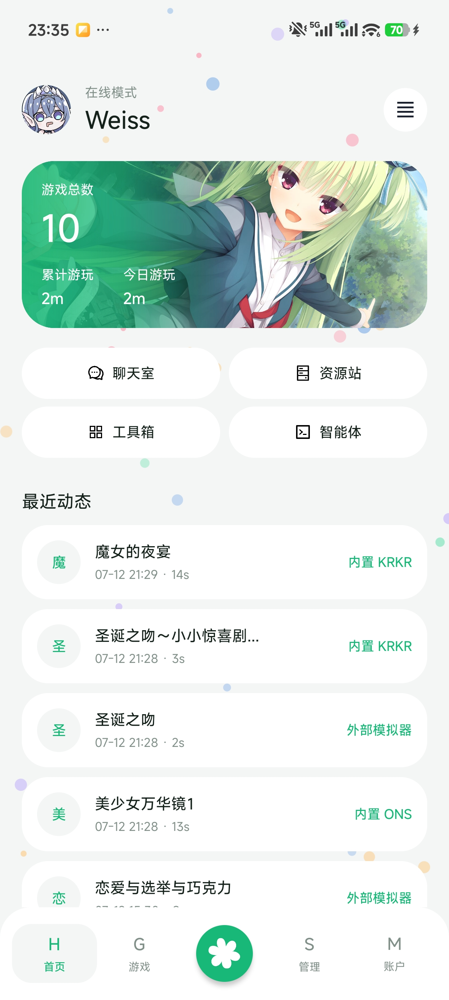</td>
      <td>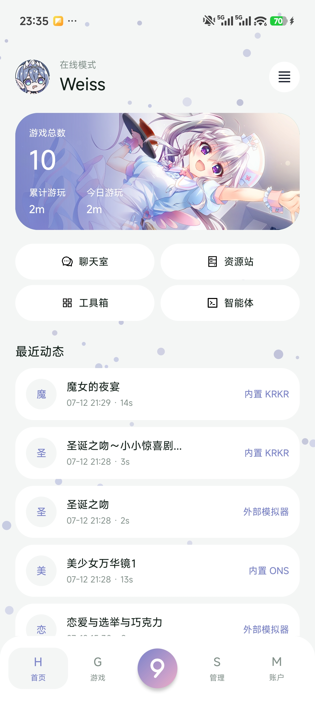</td>
      <td>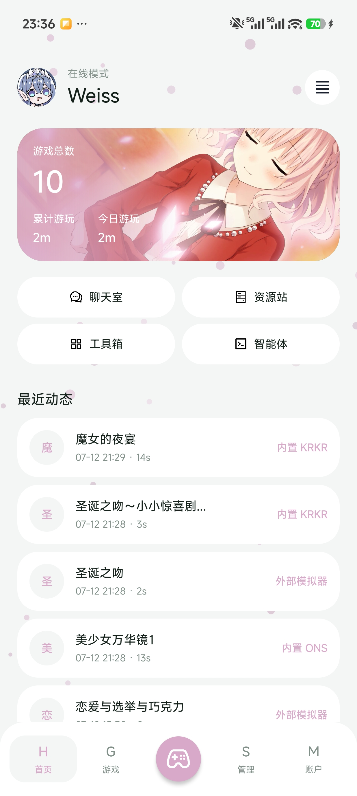</td>
    </tr>
  </table>
</p>

<p align="center">
  <table align="center">
    <tr>
      <td align="center"><b>主题菜单</b></td>
      <td align="center"><b>粒子背景</b></td>
      <td align="center"><b>深色模式</b></td>
    </tr>
    <tr>
      <td>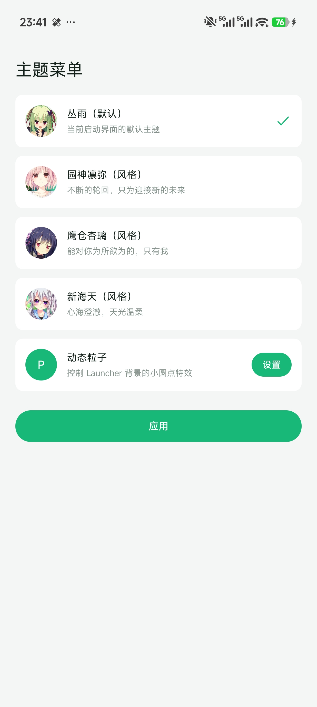</td>
      <td>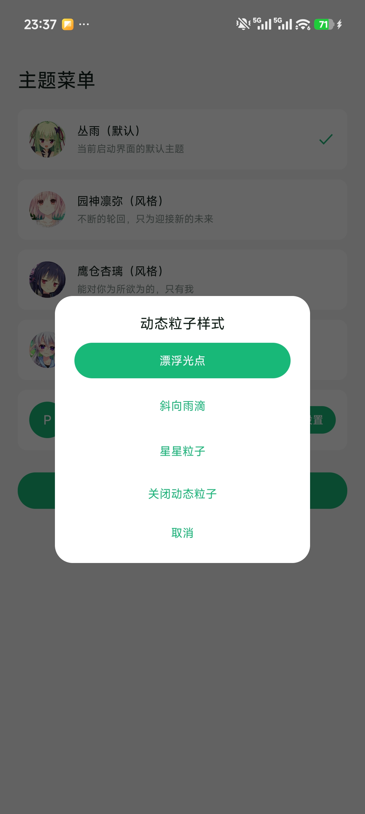</td>
      <td>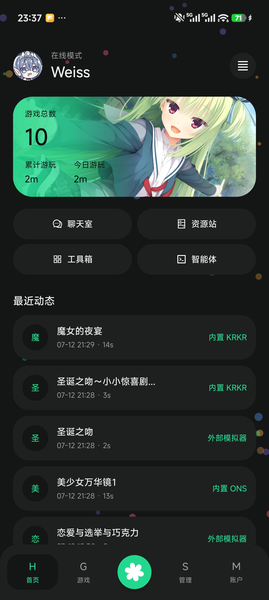</td>
    </tr>
  </table>
</p>

<p align="center">
  <table align="center">
    <tr>
      <td align="center"><b>游戏仓库</b></td>
      <td align="center"><b>管理设置</b></td>
      <td align="center"><b>个人中心</b></td>
    </tr>
    <tr>
      <td>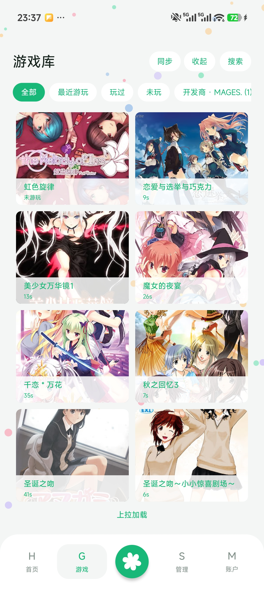</td>
      <td>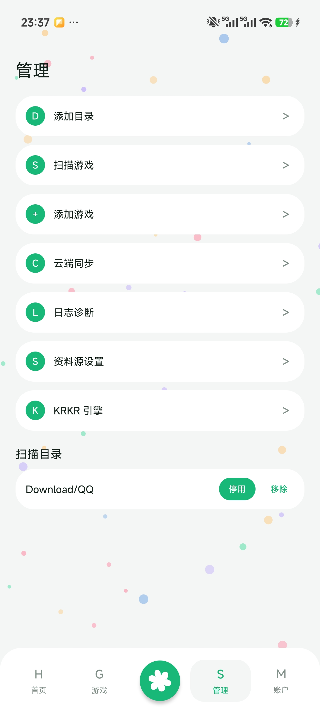</td>
      <td>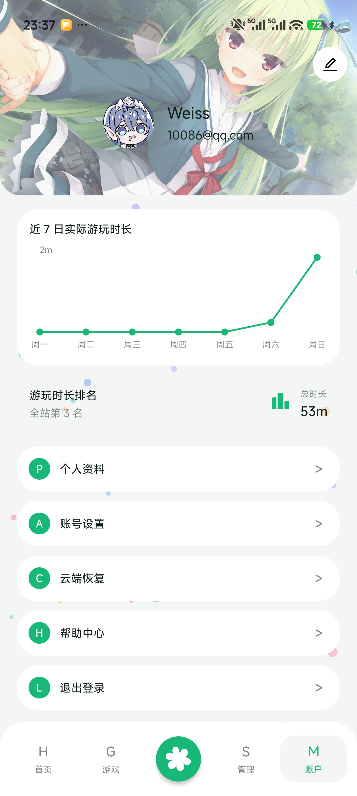</td>
    </tr>
  </table>
</p>

<p align="center">
  <table align="center">
    <tr>
      <td align="center"><b>部分设置</b></td>
      <td align="center"><b>部分设置</b></td>
      <td align="center"><b>部分设置</b></td>
    </tr>
    <tr>
      <td>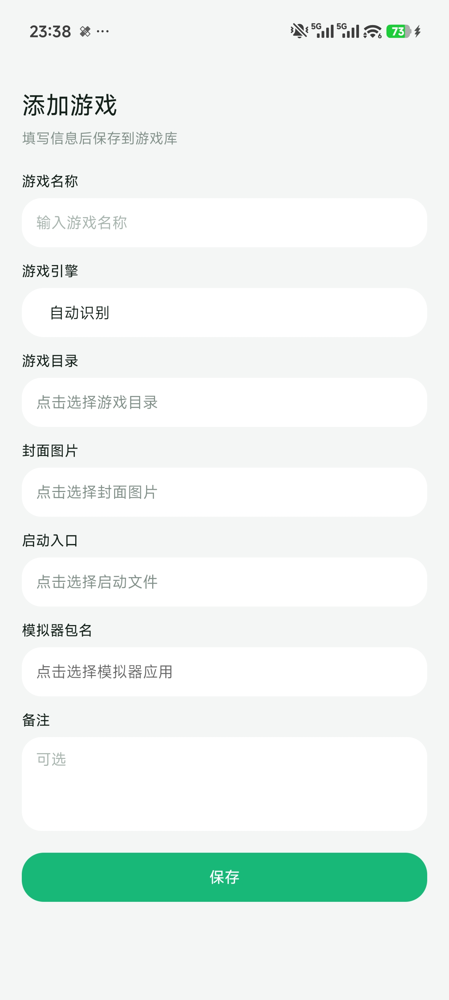</td>
      <td>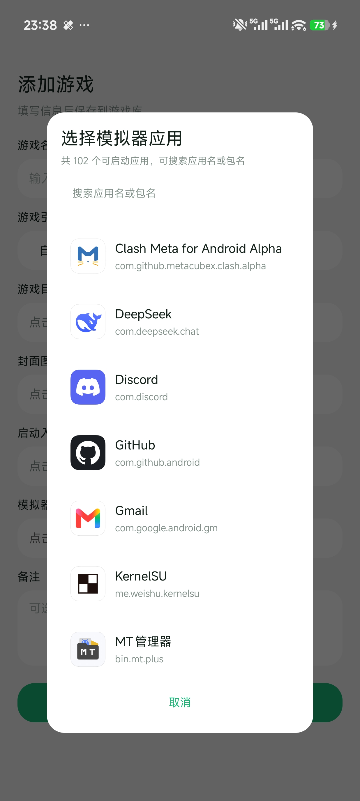</td>
      <td>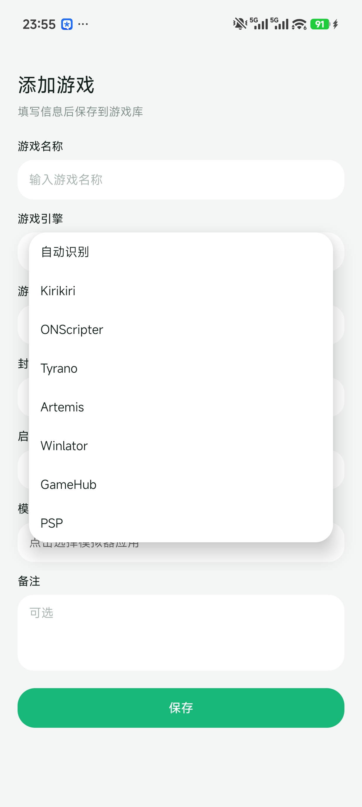</td>
    </tr>
  </table>
</p>

<p align="center">
  <table align="center">
    <tr>
      <td align="center"><b>部分设置</b></td>
      <td align="center"><b>部分设置</b></td>
      <td align="center"><b>部分设置</b></td>
    </tr>
    <tr>
      <td>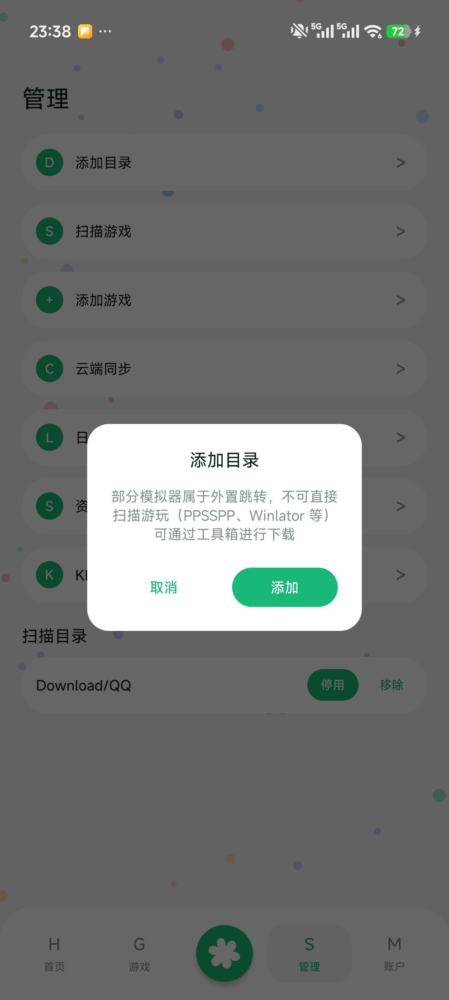</td>
      <td>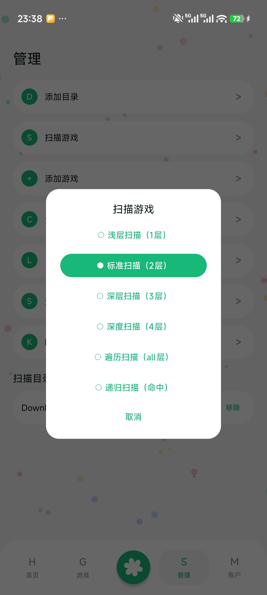</td>
      <td></td>
    </tr>
  </table>
</p>


<p align="center">
  <table>
    <tr>
      <td>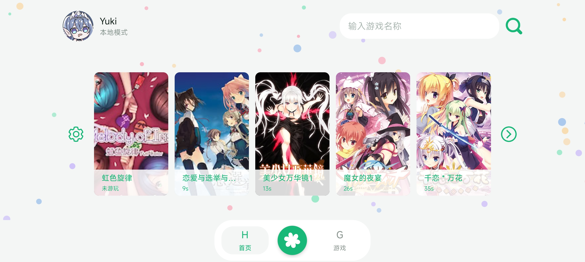</td>
    </tr>
    <tr>
      <td>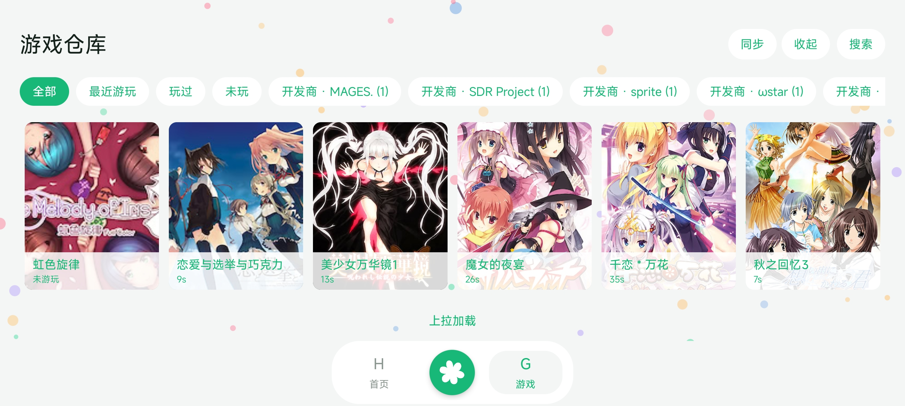</td>
    </tr>
    <tr>
      <td>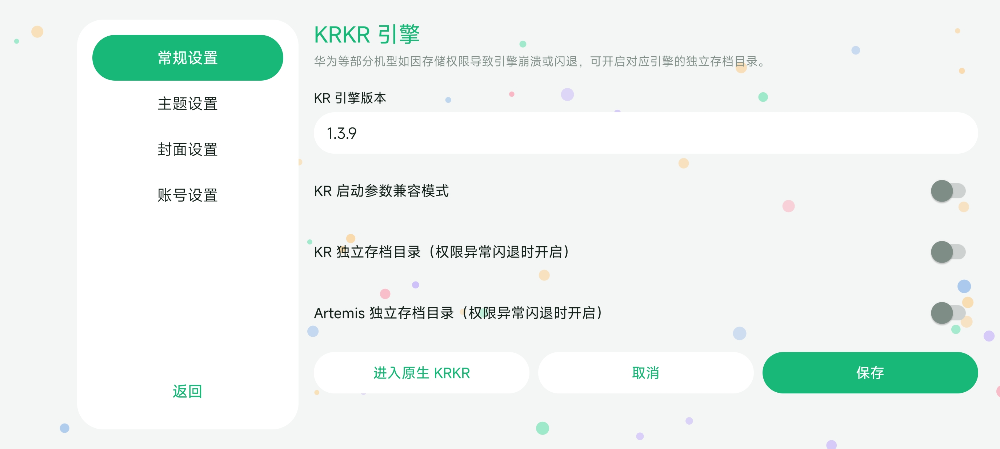</td>
    </tr>
  </table>
</p>


***

## 特性

- **统一游戏库**：添加、编辑、删除并管理本地游戏、安卓应用和外部启动入口。
- **游戏资料**：集成 VNDB 与 Bangumi 数据源，便于补充游戏信息。
- **灵活启动**：支持空目录条目、包名启动、自定义快捷方式和多种启动方式。
- **GameHub 导入**：导入快捷方式后可显示图标并进行搜索筛选。
- **数据同步**：支持游戏条目、游玩记录的导入、导出与同步；空目录条目可匹配并恢复。
- **使用保障**：内置免责声明确认流程，并提供深色界面与横屏体验。

***

## 项目定位

一个 **本地游戏管理中心**，而不是单纯的游戏启动器。

它适合以下场景：

- 管理本地安装的游戏
- 管理安卓应用型游戏条目
- 管理外部启动入口
- 统一整理快捷方式
- 记录和同步游玩记录
- 在多设备之间迁移游戏数据

***

## 项目结构

```

├── app/                              # 主应用模块
│   └── src/main/
│       ├── java/
│       │   ├── com/apps/             # Launcher UI 层
│       │   │   ├── account/          # 账号（登录/注册/免责声明）
│       │   │   ├── chat/             # AI 对话与公共聊天
│       │   │   ├── game/             # 游戏库管理
│       │   │   ├── home/             # 首页
│       │   │   ├── profile/          # 个人中心
│       │   │   ├── leaderboard/      # 排行榜
│       │   │   ├── settings/         # 设置与工具箱
│       │   │   ├── sync/             # 数据同步
│       │   │   ├── theme/            # 主题与动效
│       │   │   ├── widget/           # 自定义控件
│       │   │   ├── data/             # 仓库与 ViewModel
│       │   │   ├── PadUi/            # 平板适配 UI
│       │   │   └── UserData/         # 用户数据导入导出
│       │   └── com/yuki/yukihub/     # Core 层 + Bridge
│       │       ├── data/             # 数据库与仓库
│       │       ├── metadata/         # 元数据（VNDB / Bangumi）
│       │       ├── launcher/         # 启动器
│       │       ├── launcherbridge/   # Bridge 通道
│       │       ├── model/            # 数据模型
│       │       ├── net/              # 网络层
│       │       ├── scanner/          # 引擎检测与扫描
│       │       ├── sync/             # 同步管理
│       │       ├── tyrano/           # Tyrano 引擎
│       │       └── util/             # 工具类
│       └── res/                      # 资源文件
├── engine/                           # 引擎独立 library 模块
│   └── src/main/
│       ├── java/                     # KRKR / ONS / Artemis 等引擎
│       ├── jniLibs/                  # 原生库（arm64）
│       └── assets/                   # 引擎运行时资源
├── gradle/
│   └── libs.versions.toml            # 版本目录
└── third_party/                      # 第三方组件
```

***

## 核心功能

### 1. 游戏管理

支持添加、编辑、删除游戏条目，并对不同类型的启动项进行统一管理。

### 2. 当前扫描与启动覆盖

目录扫描会先探测所选根目录本身，再扫描其子目录和入口文件；可直接选择单个游戏目录，也可选择包含多个游戏的上级目录。

| 类型 | 自动扫描特征 | 扫描导入后的状态 |
| --- | --- | --- |
| Kirikiri | `.xp3`、`startup.tjs`、`config.tjs` | 使用内置 KRKR 启动。多个 XP3 候选会要求选择入口。 |
| ONScripter | `0.txt`、`nscript.dat`、`onscript.nt*`、`.nsa`、`.sar` | 使用内置 ONScripter 启动。 |
| Tyrano | `index.html` 与 Tyrano / Electron 目录特征 | 使用内置 Tyrano 启动。 |
| Artemis | `system.ini`、`system/first.iet`、`.pfs` | 使用内置 Artemis 启动。 |
| Winlator | `.desktop` 快捷方式 | 可识别；需选择已安装且支持外部直启的 Winlator 包名。`.exe` 入口目前请通过“添加游戏”手动添加。 |
| PSP | `.iso`、`.cso`、`.chd`、`.elf`、`.pbp` | 以实际文件 URI 导入，启动需要安装 PPSSPP。标题和封面当前主要取文件名与目录图片，尚未解析 `PARAM.SFO` / `ICON0.PNG`。 |
| GameHub（盖世） | 不通过目录扫描 | 通过 Shizuku 读取盖世桌面快捷方式并导入 `localGameId`。 |

安卓应用、外部包名启动项和自定义快捷方式同样属于可管理条目，但当前不在目录自动扫描范围内，应通过手动添加或对应的快捷方式导入入口创建。项目当前没有 RMMZ 的 `EngineType`、自动识别或启动策略，不将其列为已支持的扫描类型。

### 3. 空目录条目支持

通过快捷方式导入、同步恢复或既有条目可保留空目录入口；当前“添加游戏”页面需要先选择游戏目录。

这对于以下场景尤其有用：

- 直接启动安卓应用
- 使用包名启动的条目
- 外部程序入口
- 自定义快捷启动项

### 4. GameHub 快捷方式导入

支持通过 Shizuku 从 GameHub 中读取桌面快捷方式，并提供：

- 图标显示
- 搜索筛选
- 更清晰的列表选择体验

### 5. 同步功能

支持游戏数据与游玩记录的导入、导出与同步，适合本地备份和多设备迁移；同时支持 ☁️ WebDAV 云同步。

同步时会尽量根据以下信息进行匹配：

- root 路径
- 本地 ID
- 游戏标题

对于空目录条目，会优先按标题进行匹配。

### 6. 游戏时长记录

从应用内启动游戏后开始计时；当你返回应用前台时，本次计时结束。若应用在后台被系统关闭，重新打开后仍会保留已记录的时长。

> 注意：游戏进行中若先返回应用前台，再直接切回游戏，后续时长不会自动续计。请从应用内重新启动游戏以开始新的计时。

***

## 教程区

### 导入 Winlator 和盖世的游戏并直启动

<p>
  <a href="https://b23.tv/Qixj22k">
    
  </a>
  <a href="https://github.com/xm486/YukiHub/releases/tag/v0.1.0">
  
</a>
</p>

> 说明
>
> - Winlator 改包基于 hostei2 的改版，将 `XServerDisplayActivity` 的 `android:exported` 设为 `true`，以支持外部直启。
> - 盖世游戏改包基于原版 5.3.5，包含 MT 文件提取器注入及活动导出配置；需将 `com.xj.landscape.launcher.ui.gamedetail.GameDetailActivity` 的 `android:exported` 设为 `true`。

### 使用 WebDAV 进行数据云同步的教程

<p>
  <a href="https://b23.tv/wuOvs5l">
    
  </a>
</p>

***

### 已解决的兼容性说明

- TF 卡中的 KRKR 游戏现可通过镜像目录启动，存档位置与独立存档模式保持一致。
- 华为等设备的存储访问兼容性已改善：可尝试启用“外部私有存档”或轻量级 SAF。若仍有问题，欢迎反馈设备与复现信息。

欢迎有能力的开发者提交 Pull Request。😽

***

## 交流群

<p align="center">
  <a href="https://qun.qq.com/universal-share/share?ac=1&authKey=nZMa0s3mxxG1A0f%2BY0nAWmBYpul7FWTEDI6UWrzqb2IgKC4aDkUhvkV2AekAkW%2F1&busi_data=eyJncm91cENvZGUiOiIxNjM2MDM2MzUiLCJ0b2tlbiI6Im93eFRyY0tqNDdxK3FGQXlVZ0lhMEZGbWZWemphZnpYYW1kWWpPN1ViL3A0SkRUd1dEclMwZkM1bWI0UEYxME4iLCJ1aW4iOiIzMDg2Njc4NzU1In0%3D&data=bwoLG7XAPzqsvtfneNCQUUlu-HpX1yCn-6dkgd8ubDeBJKEPgd7wKYa6ym-EbW07Vapc3xm_o-iy0GbFHhZk5Q&svctype=4&tempid=h5_group_info">
    
  </a>
</p>

<p align="center">欢迎加入 QQ 交流群，反馈问题、提建议或一起讨论功能。</p>

***

## 使用前说明

首次启动时，需阅读并勾选同意免责声明后才能继续使用。

请仅使用本项目管理和启动你**有权使用**的游戏、应用或资源。

本项目不提供：

- 游戏本体
- 破解资源
- 绕过授权的能力
- 任何违规用途的支持

***

## 系统要求

- Android 8.0（API 26）及以上
- 需授予部分文件访问权限
- 部分功能受系统兼容性和第三方组件支持情况影响

***

## 权限说明

本应用可能会请求以下权限：

- **文件读写权限**：读取和管理游戏文件、目录与配置。
- **全盘文件访问权限**：支持部分目录型游戏的管理场景。
- **网络权限**：用于数据同步、在线资源及相关功能。

> 请仅在你明确理解并接受用途时授予权限。

***

## 安装方式

### 方法 1：直接安装 APK

从 [Releases](https://github.com/Weiss-UltimateSavior/RinneMobile/releases) 页面下载 APK 后安装。

### 方法 2：自行编译

如需自行编译，请先准备：

- Android Studio
- Android SDK
- Gradle 环境

随后使用 Android Studio 打开项目并执行构建。

***

## 构建信息

- Min SDK: `26`
- Target SDK: `33`
- Compile SDK: `36`
- Java: `17`
- Android Gradle Plugin: `8.13.2`
- 多模块架构：`app` + `engine`（引擎独立 library 模块）
- 代码压缩：R8 + 资源压缩（Release）
- 当前版本：`0.1.4`（Version Code: `6`）

***

## 使用说明

- 项目仍在持续打磨中，功能和兼容性会逐步完善。
- 同步与云功能依赖外部服务的可用性。
- 部分兼容启动入口依赖设备环境及第三方应用支持。

***

## 开源协议

本项目采用 **GNU General Public License v3.0 (GPL-3.0)** 开源。

在遵守 GPL-3.0 协议的前提下，你可以自由使用、修改、分发本项目，并进行二次开发。

***

## 免责声明

本项目仅限合法用途。作者不对以下情况负责：

- 用户自身操作失误
- 第三方资源问题
- 系统兼容性问题
- 第三方服务不可用
- 由用户使用本软件产生的任何违规行为

请仅使用本项目管理和启动你有权使用的软件、游戏或资源。

***

## 致谢

本项目参考或学习了以下项目：

- krkr2
- YukiHub
- Tyranor
- Beacon
- <a href="https://github.com/Saramanda9988/LunaBox">LunaBox</a>
- Playnite
- <a href="https://github.com/YuriSizuku/OnscripterYuri">OnscripterYuri</a>
- <a href="https://github.com/hrydgard/ppsspp">ppsspp</a>

同时感谢所有参与测试、反馈与提出建议的用户。

***

## 反馈与贡献

遇到问题或有改进建议，欢迎提交 Issue 或 Pull Request。为便于定位问题，反馈时建议附上：

- 设备型号
- Android 版本
- 问题截图
- 复现步骤
- 日志信息

这些信息将有助于更快定位问题。

***

## License

[GPL-3.0](./LICENSE)
