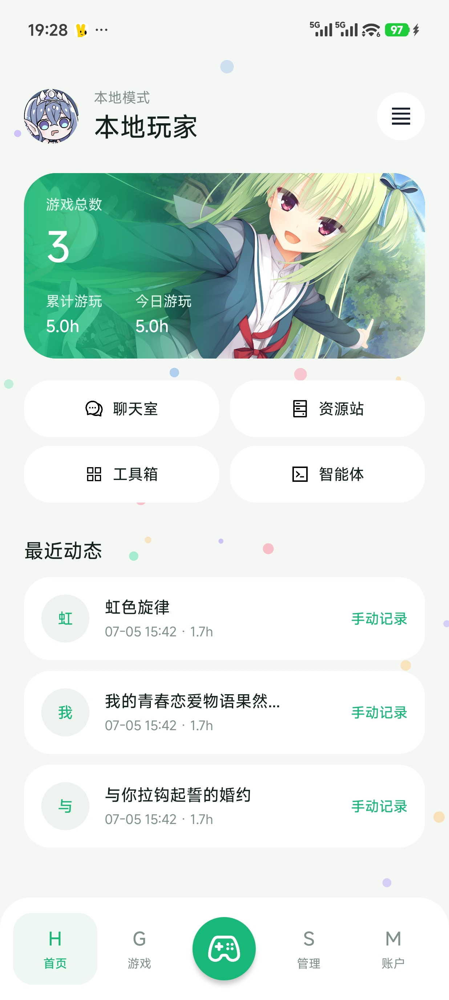
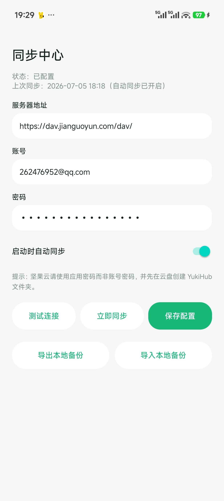
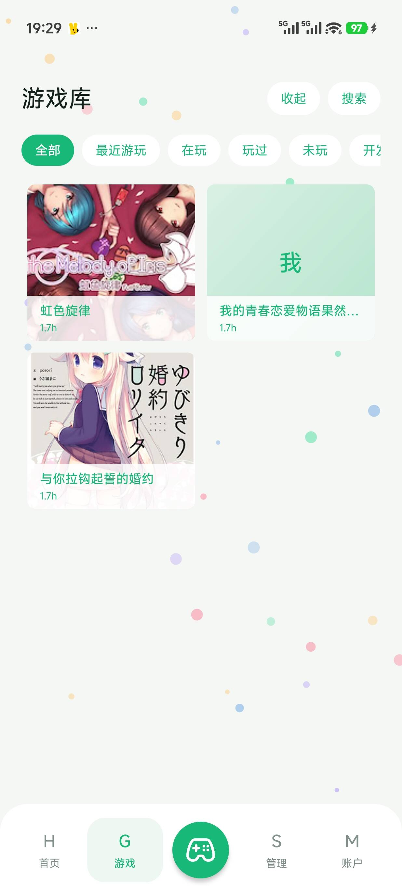
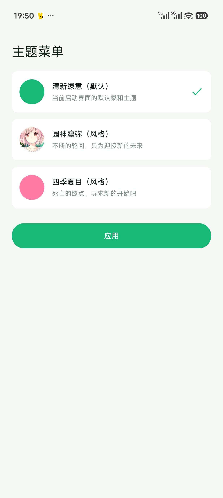
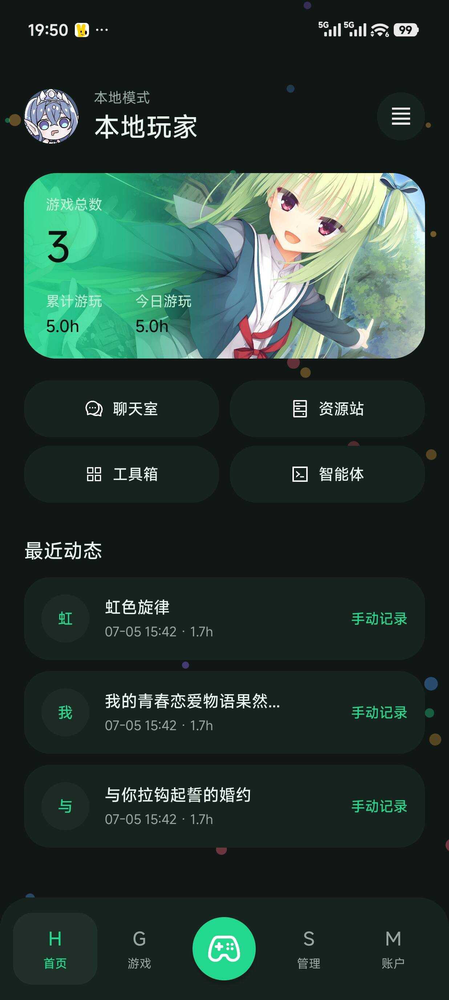
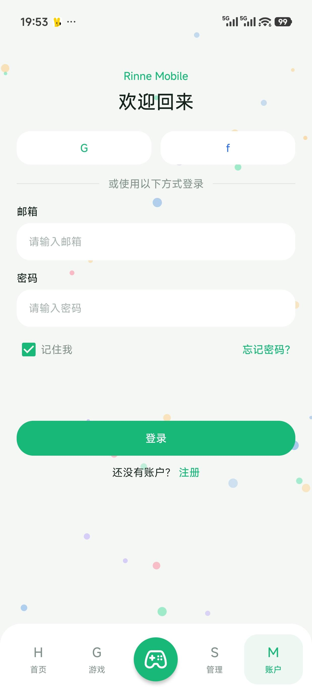
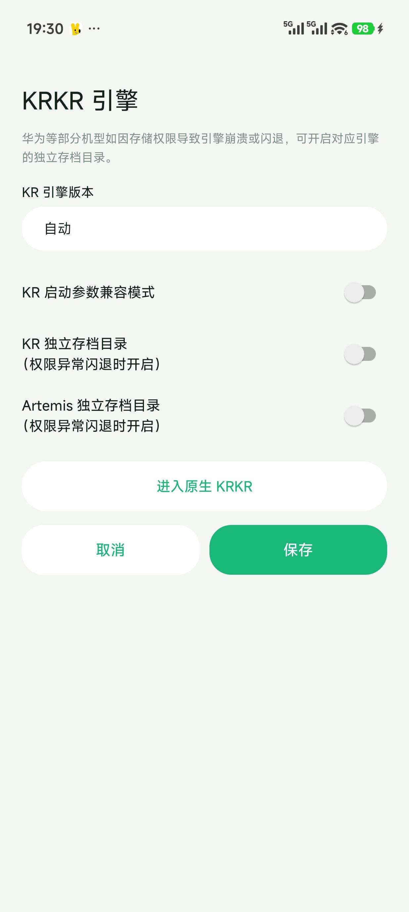

# Rinne Mobile

<p align="center">
  
</p>

<p align="center">
  <a href="./README.md">简体中文</a> | <a href="./README_EN.md">English</a>
</p>

<p align="center">
  
  
  
  
</p>

An Android Galgame / visual novel management and launcher tool. It is suitable for managing local games, Android app-style entries, emulator game launch entries, external program shortcuts, and play records.

Its goal is to integrate “game library management, quick launch, data synchronization, and metadata lookup” into a unified mobile interface.

This is a branch version based on secondary development of YukiHub.

> This project is open-sourced under the **GPL-3.0** license.

---

## Features

* Supports adding, editing, and deleting game entries
* Integrates game metadata sources from VNDB and Bangumi
* Supports game entries with empty directories

  * Suitable for Android app-style games, external programs, and custom launch entries
* Supports importing GameHub shortcuts

  * Shortcut list supports icon display
  * Supports search and filtering
* Supports multiple launch methods
* Supports local games, Android app-style entries, and external launch entries
* Supports game synchronization and import/export

  * Supports game entry synchronization
  * Supports play record synchronization
  * Supports matching and restoring empty-directory entries
* Supports viewing the complete disclaimer in Settings
* Requires accepting the disclaimer on first launch before entering
* Dark-style interface, suitable for landscape use

---

## Project Positioning

A **local game management center**, not just a simple game launcher.

It is suitable for the following scenarios:

* Managing locally installed games
* Managing Android app-style game entries
* Managing external launch entries
* Organizing shortcuts in one place
* Recording and synchronizing play records
* Migrating game data across multiple devices

---

## Project Structure

```
YukiHub/
├── app/                              # Main application module
│   └── src/main/
│       ├── java/
│       │   ├── com/apps/             # Launcher UI layer
│       │   │   ├── account/          # Account (login/register/disclaimer)
│       │   │   ├── chat/             # AI chat & public chat
│       │   │   ├── game/             # Game library management
│       │   │   ├── home/             # Home screen
│       │   │   ├── profile/          # Profile
│       │   │   ├── leaderboard/      # Leaderboard
│       │   │   ├── settings/         # Settings & toolbox
│       │   │   ├── sync/             # Data sync
│       │   │   ├── theme/            # Theme & animations
│       │   │   ├── widget/           # Custom widgets
│       │   │   ├── data/             # Repository & ViewModel
│       │   │   ├── PadUi/            # Tablet UI
│       │   │   └── UserData/         # User data import/export
│       │   └── com/yuki/yukihub/     # Core layer + Bridge
│       │       ├── data/             # Database & repository
│       │       ├── metadata/         # Metadata (VNDB / Bangumi)
│       │       ├── launcher/         # Launcher
│       │       ├── launcherbridge/   # Bridge channel
│       │       ├── model/            # Data models
│       │       ├── net/              # Network layer
│       │       ├── scanner/          # Engine detection & scanning
│       │       ├── sync/             # Sync manager
│       │       ├── tyrano/           # Tyrano engine
│       │       └── util/             # Utilities
│       └── res/                      # Resources
├── engine/                           # Standalone engine library module
│   └── src/main/
│       ├── java/                     # KRKR / ONS / Artemis / RMMZ engines
│       ├── jniLibs/                  # Native libraries (arm64)
│       └── assets/                   # Engine runtime assets
├── gradle/
│   └── libs.versions.toml            # Version catalog
└── third_party/                      # Third-party components
```

---

## Core Features

### 1. Game Management

Supports adding, editing, and deleting game entries, and provides unified management for different types of launch entries.

### 2. Empty-directory Entry Support

For games or app entries that do not require a local directory, the directory field is not mandatory.

This is especially useful for the following scenarios:

* Directly launching Android apps
* Entries launched by package name
* External program entries
* Custom quick-launch entries

### 3. GameHub Shortcut Import

Supports importing shortcuts from GameHub and provides:

* Icon display
* Search and filtering
* A clearer list selection experience

### 4. Synchronization

Supports synchronization, import, and export of game data and play records, suitable for local backup or multi-device migration. It also supports ☁️ WebDAV cloud synchronization.

During synchronization, matching will be attempted based on the following information:

* root path
* local ID
* game title

For empty-directory entries, title matching is prioritized.

### 5. Play Time Recording

* The current play time recording mode works as follows: when you launch a game from the app, timing starts; when you return to the app foreground, timing ends. It is fine if the app is sent to the background midway, and the time can still be recorded when you return. However, do not switch back to the app out of curiosity halfway through and then immediately return to the game, because the remaining time after that will not be counted. You need to launch the game from the app again for a new session to be recorded.

---

## Screenshots

<p align="center">
  <table align="center">
    <tr>
      <td align="center"><b>Entry Interface</b></td>
      <td align="center"><b>Sync Page</b></td>
      <td align="center"><b>Game Library</b></td>
    </tr>
    <tr>
      <td></td>
      <td></td>
      <td></td>
    </tr>
  </table>
</p>

<p align="center">
  <table align="center">
    <tr>
      <td align="center"><b>Style Theme</b></td>
      <td align="center"><b>Dark Mode</b></td>
      <td align="center"><b>Online Features</b></td>
    </tr>
    <tr>
      <td></td>
      <td></td>
      <td></td>
    </tr>
  </table>
</p>

---

## Tutorial Area

### Import Winlator and G-station games and launch them directly

<p>
  <a href="https://b23.tv/Qixj22k">
    
  </a>
  <a href="https://github.com/xm486/YukiHub/releases/tag/v0.1.0">
  
</a>
</p>

* Notes:

  * The modified Winlator emulator package is based on the modified version by hostei2. `XServerDisplayActivity exported=false` was changed to `android:exported="true"` to expose the Activity for direct launch.
  * G-station games are based on the original version 5.3.5, with MT file extractor injection and Activity exposure. That is, add or change `android:exported="true"` for `android:name="com.xj.landscape.launcher.ui.gamedetail.GameDetailActivity"` in AndroidManifest.

### Tutorial for using WebDAV data cloud synchronization

<p>
  <a href="https://b23.tv/wuOvs5l">
    
  </a>
</p>

---

### Currently Known Issues

* 1. Direct launching KRKR games with TF card paths was previously suspected to not work. As of version `0.125+3`, this has been fixed. When running games from an SD card, the app automatically enables mirrored directory mode. Save data location is consistent with independent save mode.

* 2. Due to storage read/write restrictions on Huawei and some other phones, KRKR, Artemis, and other engine games may not play normally. An external private save option has been added. You can try enabling it; maybe it helps. A lightweight SAF option has also been added 🤔. Whether it works still depends on testing. Feature entry is shown below. ✓ As of version `0.12.5+1`, this has been fixed. If you still encounter issues, please report them.

<p align="center"></p>

* That is all for now. PRs from capable people are welcome meow 😽😽😽

---

## Community Group

<p align="center">
  <a href="https://qun.qq.com/universal-share/share?ac=1&authKey=nZMa0s3mxxG1A0f%2BY0nAWmBYpul7FWTEDI6UWrzqb2IgKC4aDkUhvkV2AekAkW%2F1&busi_data=eyJncm91cENvZGUiOiIxNjM2MDM2MzUiLCJ0b2tlbiI6Im93eFRyY0tqNDdxK3FGQXlVZ0lhMEZGbWZWemphZnpYYW1kWWpPN1ViL3A0SkRUd1dEclMwZkM1bWI0UEYxME4iLCJ1aW4iOiIzMDg2Njc4NzU1In0%3D&data=bwoLG7XAPzqsvtfneNCQUUlu-HpX1yCn-6dkgd8ubDeBJKEPgd7wKYa6ym-EbW07Vapc3xm_o-iy0GbFHhZk5Q&svctype=4&tempid=h5_group_info">
    
  </a>
</p>

<p align="center">Welcome to join the QQ community group to report issues, make suggestions, or discuss features together.</p>

---

## Before Use

This project has a built-in disclaimer mechanism. On first launch, you need to check and agree to the disclaimer before continuing.

Please make sure you only use it to manage and launch games, apps, or resources that you have the right to use.

This project does not provide:

* Game files
* Cracked resources
* Ability to bypass authorization
* Support for any illegal use

---

## System Requirements

* Android 8.0 or above
* Requires partial file access permissions
* Some features may depend on system compatibility or third-party component support

---

## Permission Description

This app may request the following permissions:

* File read/write permission
* All files access permission
* Network permission

Purpose description:

* File permissions: used to read and manage game files, directories, and configurations
* Network permission: used for synchronization, online resources, or related features
* All files access: used for some directory-based game management scenarios

> Please grant permissions only when you clearly understand and accept their purposes.

---

## Installation

### Method 1: Install APK directly

Download the APK from the Releases page and install it.

### Method 2: Build it yourself

If you want to build the project yourself, please make sure you have installed:

* Android Studio
* Android SDK
* Gradle environment

Then open the project and run the build.

---

## Build Information

* Application ID: `com.yuki.yukihub`
* Min SDK: `26`
* Target SDK: `33`
* Compile SDK: `36`
* Java: `17`
* Android Gradle Plugin: `8.13.2`
* Multi-module architecture: `app` + `engine` (standalone engine library module)
* Code shrinking: R8 + resource shrinking (Release)
* Current version: `0.1.4` (Version Code: `6`)

---

## Notes

* The project is currently in a continuous polishing stage before and after open-source release
* Some synchronization or cloud features depend on external service availability
* Some compatibility entries depend on the device environment and third-party app support

---

## Open Source License

This project is open-sourced under the **GNU General Public License v3.0 (GPL-3.0)**.

You may:

* Use it freely
* Modify it freely
* Distribute it freely
* Carry out secondary development under GPL-3.0 restrictions

Please use this project's source code under the terms of GPL-3.0.

---

## Disclaimer

This project is for legal use only.

The author is not responsible for the following situations:

* User operation mistakes
* Third-party resource issues
* System compatibility issues
* Third-party service unavailability
* Any illegal behavior caused by the user's use of this software

Please make sure you only use it to manage and launch software, games, or resources that you have the right to use.

---

## Acknowledgements

Thanks to the projects used as references and learning materials:

* krkr2
* YukiHub
* Tyranor
* Beacon
* <a href="https://github.com/Saramanda9988/LunaBox">LunaBox</a>
* Playnite
* <a href="https://github.com/YuriSizuku/OnscripterYuri">OnscripterYuri</a>
* <a href="https://github.com/hrydgard/ppsspp">ppsspp</a>

Thanks also to all users who participated in testing, feedback, and suggestions.

---

## Feedback and Contribution

If you encounter problems during use, feel free to submit an Issue or Pull Request.

You can also include the following when submitting feedback:

* Device model
* Android version
* Problem screenshots
* Reproduction steps
* Log information

This makes it easier to locate the issue.

---

## License

[GPL-3.0](./LICENSE)
