# Rinne Mobile

<p align="center">
  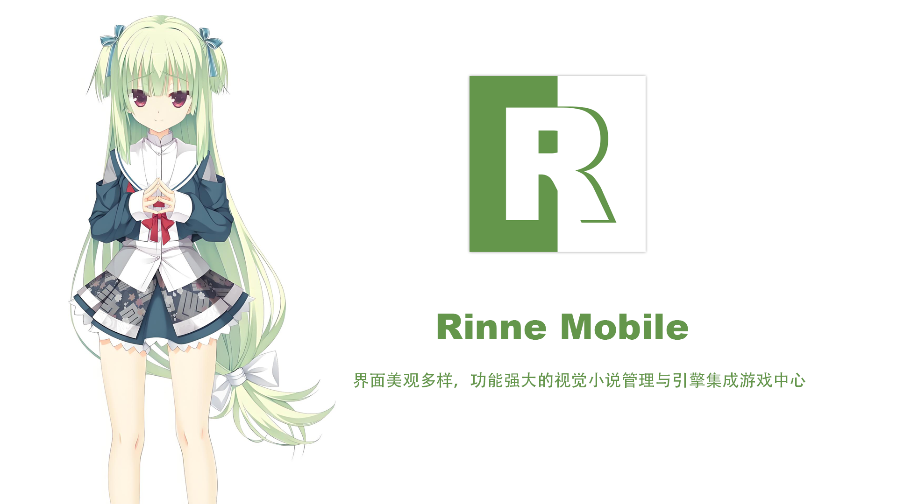
</p>

<p align="center">
  <a href="./README.md">简体中文</a> | <a href="./README_EN.md">English</a>
</p>

<p align="center">
  
  
</p>

An Android Galgame / visual novel management and launcher tool with support for mainstream game engines. It is suitable for playing and managing local games, Android apps, game entries, external-program shortcuts, and play records.

Its goal is to bring “game library management, quick launch, data synchronization, metadata lookup, and game-engine support” together in one unified mobile management center.

This is a YukiHub-derived version rebuilt with a more modern technology stack and MVVM architecture, and is currently being migrated to Kotlin as part of its third major refactor.

> This project is open-sourced under the **GPL-3.0** license.

---

## Features

- **Multi-engine Support**: Built-in KRKR, Tyrano, Artemis, and ONS engines; external modules for RPG Maker, Ren'Py, and Godot; plus external launching for mainstream game environments.
- **Unified Game Library**: Add, edit, delete, and manage local games, Android apps, and external launch entries.
- **Unified Save Management**: Import, export, replace, and manage saves for games using the built-in engines.
- **Game Metadata**: Integrated VNDB and Bangumi data sources for supplementing game information.
- **Multiple Themes**: Choose among several visual themes and animated particle backgrounds.
- **Flexible Launching**: Supports empty-directory entries, package-name launching, custom shortcuts, and multiple launch methods.
- **Local AI Agent**: Built-in AI agent that connects to your own API to query the game library, browse and search game files, assist with translation text replacement, and more. It provides two permission modes and configurable temperature and tool-call limits, and supports MCP (Model Context Protocol) Streamable HTTP servers for extended tools.
- **Data Sync**: Supports import, export, and synchronization of game entries and play records; empty-directory entries can be matched and restored.
- **Smart Translation**: Connect a multimodal model for in-game dialogue translation.
- **Usage Safeguards**: Built-in disclaimer confirmation flow, with dark mode and landscape support.

---

## Project Positioning

A **local game management center**, not just a simple game launcher.

It is suitable for the following scenarios:

* Managing locally installed games
* Managing Android app-style game entries
* Managing external launch entries
* Organizing shortcuts in one place
* Recording and synchronizing play records
* Migrating game data across multiple devices

---

## Project Structure

```
RinneMobile/
├── app/                              # Main application module
│   └── src/main/
│       ├── java/
│       │   ├── com/apps/             # Launcher UI layer
│       │   │   ├── account/          # Account (login/register/disclaimer)
│       │   │   ├── agent/            # Local AI agent
│       │   │   ├── chat/             # AI chat & public chat
│       │   │   ├── game/             # Game library management
│       │   │   ├── home/             # Home screen
│       │   │   ├── profile/          # Profile
│       │   │   ├── leaderboard/      # Leaderboard
│       │   │   ├── settings/         # Settings & toolbox
│       │   │   ├── sync/             # Data sync
│       │   │   ├── theme/            # Theme & animations
│       │   │   ├── widget/           # Custom widgets
│       │   │   ├── data/             # Repository & ViewModel
│       │   │   ├── PadUi/            # Tablet UI
│       │   │   └── UserData/         # User data import/export
│       │   └── com/core/             # Core layer + Bridge
│       │       ├── CoreApp.kt        # Application entry
│       │       ├── data/             # Database & repository
│       │       ├── diagnostics/      # Diagnostics & logging
│       │       ├── importer/         # Third-party data import (LunaBox/Playnite/Vnite/PotatoVn)
│       │       ├── launcher/         # Launcher & engine dispatch
│       │       ├── launcherbridge/   # WebView Bridge channel
│       │       ├── metadata/         # Metadata (VNDB / Bangumi)
│       │       ├── model/            # Data models
│       │       ├── net/              # Network layer
│       │       ├── scanner/          # Engine detection & scanning
│       │       ├── sync/             # Sync manager
│       │       ├── translation/      # Translation overlay service
│       │       └── util/             # Utilities
│       └── res/                      # Resources
├── engine/                           # Standalone engine library module
│   └── src/main/
│       ├── java/
│       │   ├── com/core/             # In-house engine hosts
│       │   │   ├── ons/              # ONScripter engine
│       │   │   └── tyrano/           # Tyrano engine
│       │   ├── org/tvp/kirikiri2/    # KRKR engine
│       │   ├── com/ies_net/artemis/  # Artemis engine
│       │   ├── org/libsdl/app/       # SDL foundation
│       │   └── org/cocos2dx/lib/     # Cocos2d-x foundation
│       ├── jniLibs/                  # Native libraries (arm64)
│       └── assets/                   # Engine runtime assets
├── gradle/
│   └── libs.versions.toml            # Version catalog
```

---

## Core Features

### 1. Game Management

Supports adding, editing, and deleting game entries, with unified management for different types of launch entries.

### 2. Scanning and Launch Coverage

Directory scanning first probes the selected root directory itself, then scans its subdirectories and entry files. You can select a single game directory or a parent directory containing multiple games.

| Type | Auto-scan Signatures | Post-import Status |
| --- | --- | --- |
| Kirikiri | `.xp3`, `startup.tjs`, `config.tjs` | Launched via built-in KRKR. Multiple XP3 candidates prompt for entry selection. |
| ONScripter | `0.txt`, `nscript.dat`, `onscript.nt*`, `.nsa`, `.sar` | Launched via built-in ONScripter. |
| Tyrano | `index.html` and Tyrano / Electron directory signatures | Launched via built-in Tyrano. |
| Artemis | `system.ini`, `system/first.iet`, `.pfs` | Launched via built-in Artemis. |
| Winlator | `.desktop` shortcuts | Recognized; requires selecting an installed Winlator package that supports external direct launch. `.exe` entries currently need manual addition via "Add Game". |
| Nintendo 3DS | `.3ds`, `.cci`, `.zcci`, `.cxi`, `.zcxi`, `.cia`, `.zcia`, `.3dsx`, `.z3dsx` | Imported as file URIs; launch requires Azahar emulator. Title and cover currently derived from filename and directory image. |
| RPG Maker | `.rgssad` (XP), `.rgss2a` (VX), `.rgss3a` (VX Ace), `game.ini` + `.rxdata` / `.rvdata` / `.rvdata2` | Launched via external RPG Maker plugin. Auto-detects XP / VX / VX Ace / mkxp-z sub-engines and selects the corresponding runtime. |
| Ren'Py | `.rpa`, `game/script.rpy`, `game/options.rpy`, `renpy/` directory + `.rpy` / `.rpyc` | Launched via external Ren'Py plugin. |
| PSP | `.iso`, `.cso`, `.chd`, `.elf`, `.pbp` | Imported as file URIs; launch requires PPSSPP. Title and cover currently derived from filename and directory image; `PARAM.SFO` / `ICON0.PNG` parsing not yet implemented. |
| GameHub | Not via directory scanning | Reads GameHub desktop shortcuts via Shizuku and imports `localGameId`. |

Android apps, external package-name entries, and custom shortcuts are also manageable entries but are not in the auto-scan scope — create them via manual addition or the corresponding shortcut import entry. The project currently has no RMMZ `EngineType`, auto-detection, or launch strategy, so RMMZ is not listed as a supported scan type.

### 3. Empty-directory Entry Support

Shortcuts imported via shortcut import, sync restore, or existing entries can retain empty-directory entries; the "Add Game" page currently requires selecting a game directory first.

This is especially useful for:

- Directly launching Android apps
- Entries launched by package name
- External program entries
- Custom quick-launch entries

### 4. GameHub Shortcut Import

Supports reading desktop shortcuts from GameHub via Shizuku, providing:

- Icon display
- Search and filtering
- A clearer list selection experience

### 5. Synchronization

Supports import, export, and synchronization of game data and play records, suitable for local backup and multi-device migration. Also supports ☁️ WebDAV cloud sync.

Matching is attempted based on:

- root path
- local ID
- game title

For empty-directory entries, title matching is prioritized.

### 6. Play Time Recording

Timing starts when you launch a game from the app; it ends when you return to the app foreground. If the app is killed in the background, recorded time is still preserved when you reopen it.

> Note: If you return to the app foreground mid-game and then switch back to the game directly, subsequent time will not be auto-counted. Relaunch the game from the app to start a new session.

---

## Screenshots

<p align="center">
  <table align="center">
    <tr>
      <td align="center"><b>Theme 1</b></td>
      <td align="center"><b>Theme 2</b></td>
      <td align="center"><b>Theme 3</b></td>
    </tr>
    <tr>
      <td>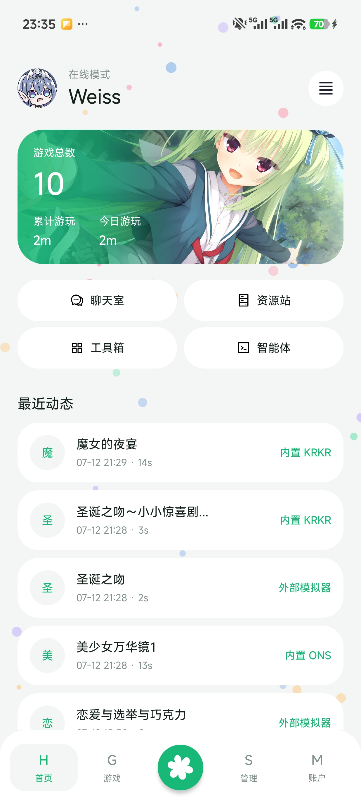</td>
      <td>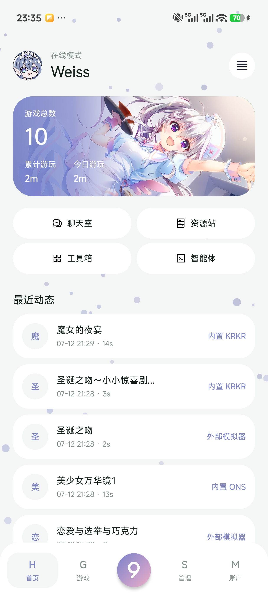</td>
      <td>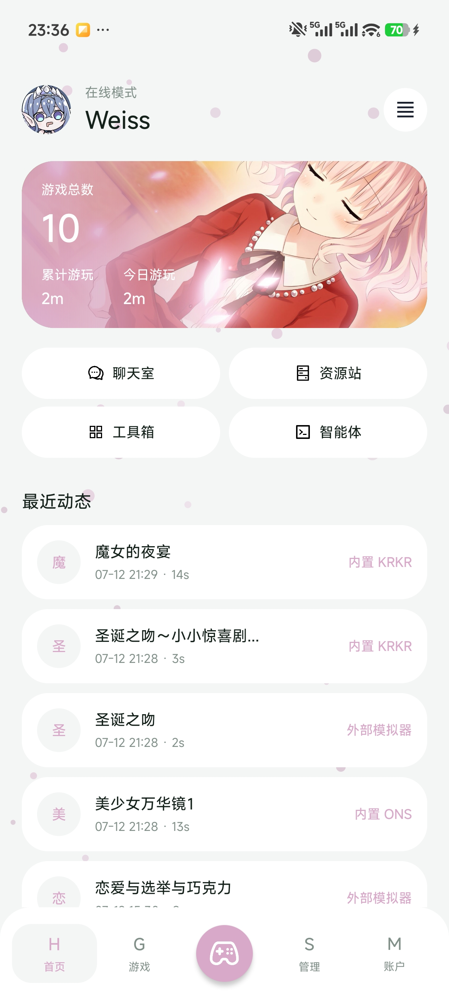</td>
    </tr>
  </table>
</p>

<p align="center">
  <table align="center">
    <tr>
      <td align="center"><b>Theme Menu</b></td>
      <td align="center"><b>Particle Background</b></td>
      <td align="center"><b>Dark Mode</b></td>
    </tr>
    <tr>
      <td>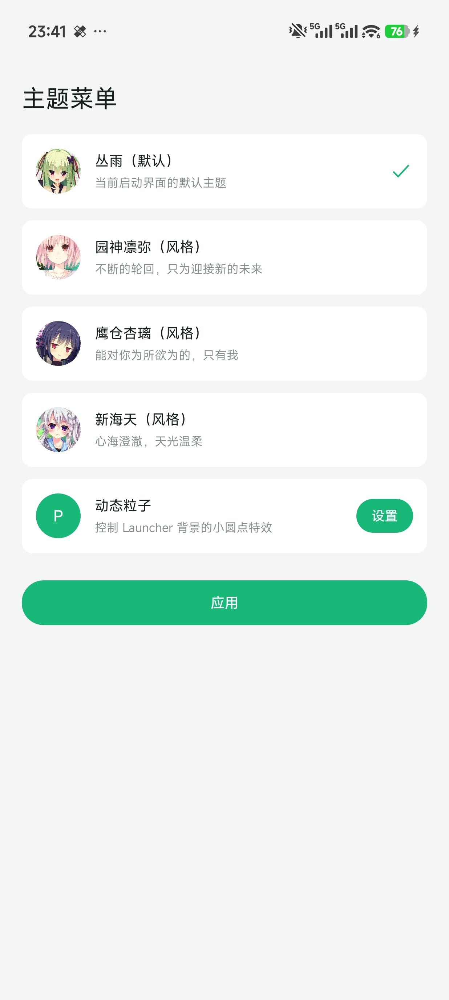</td>
      <td>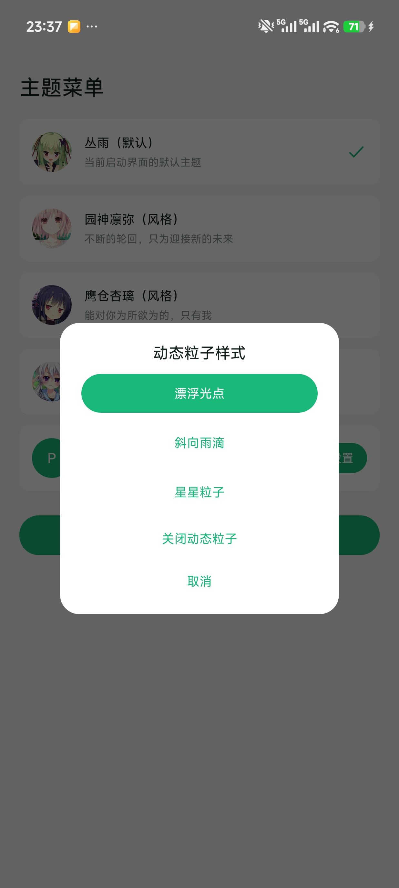</td>
      <td>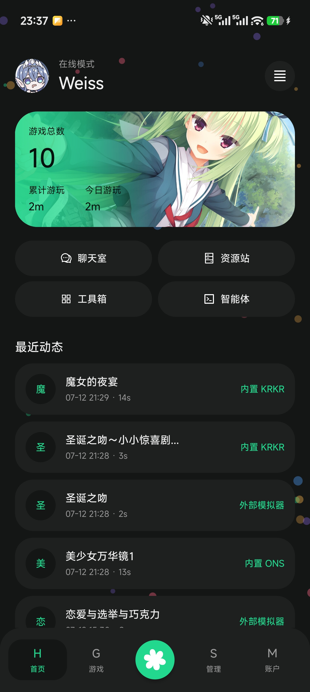</td>
    </tr>
  </table>
</p>

<p align="center">
  <table align="center">
    <tr>
      <td align="center"><b>Game Library</b></td>
      <td align="center"><b>Manage Settings</b></td>
      <td align="center"><b>Profile</b></td>
    </tr>
    <tr>
      <td>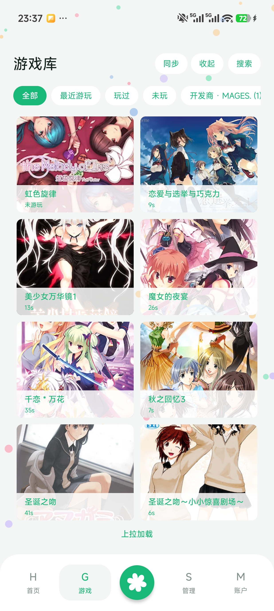</td>
      <td>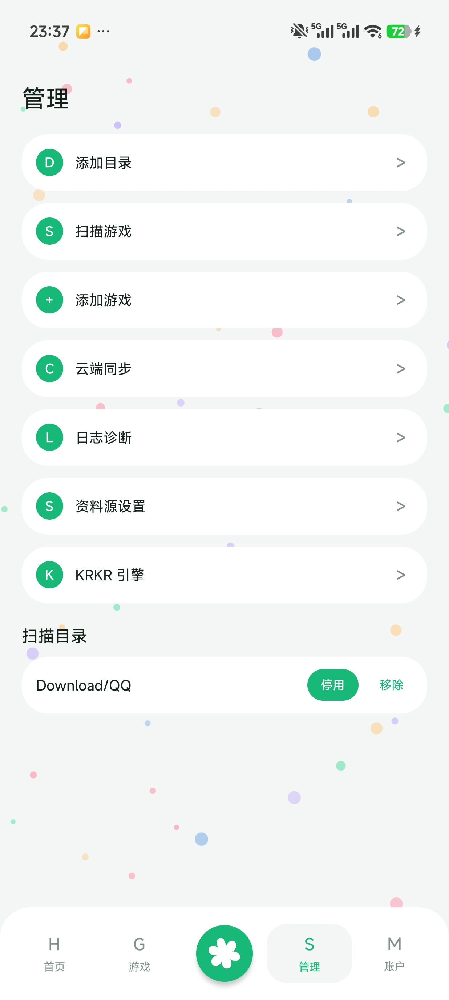</td>
      <td>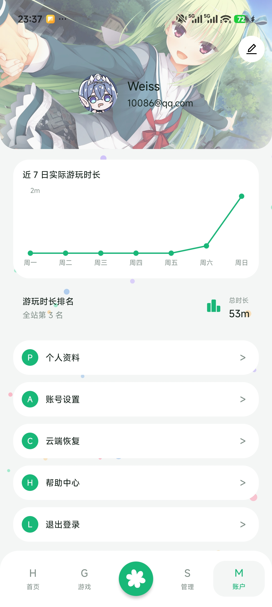</td>
    </tr>
  </table>
</p>

<p align="center">
  <table align="center">
    <tr>
      <td align="center"><b>Game Management</b></td>
      <td align="center"><b>Game Management</b></td>
      <td align="center"><b>Game Management</b></td>
    </tr>
    <tr>
      <td>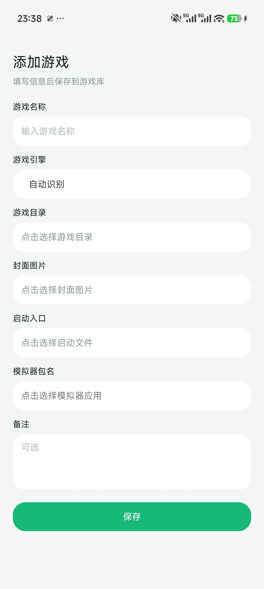</td>
      <td>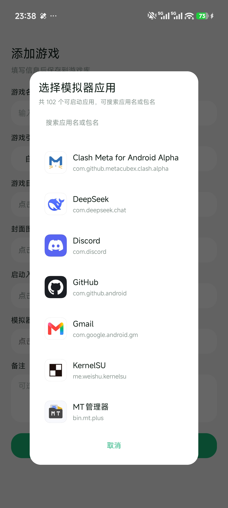</td>
      <td>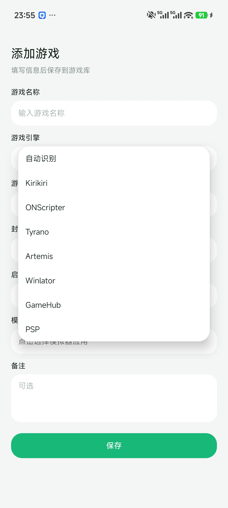</td>
    </tr>
  </table>
</p>

<p align="center">
  <table align="center">
    <tr>
      <td align="center"><b>Features</b></td>
      <td align="center"><b>Features</b></td>
      <td align="center"><b>Features</b></td>
    </tr>
    <tr>
      <td>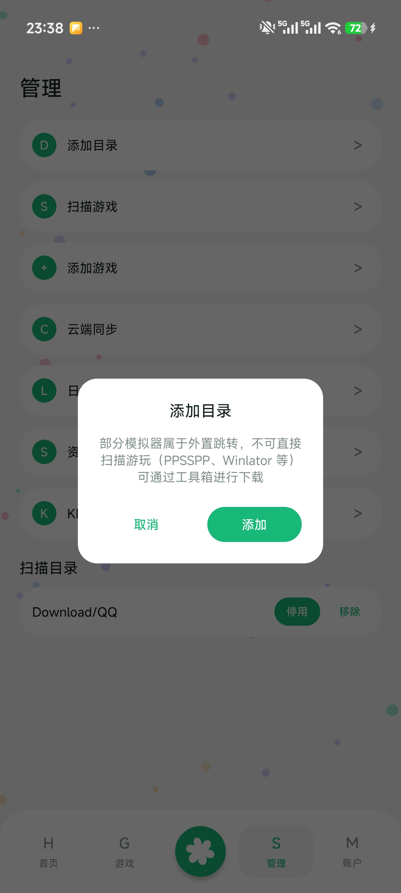</td>
      <td>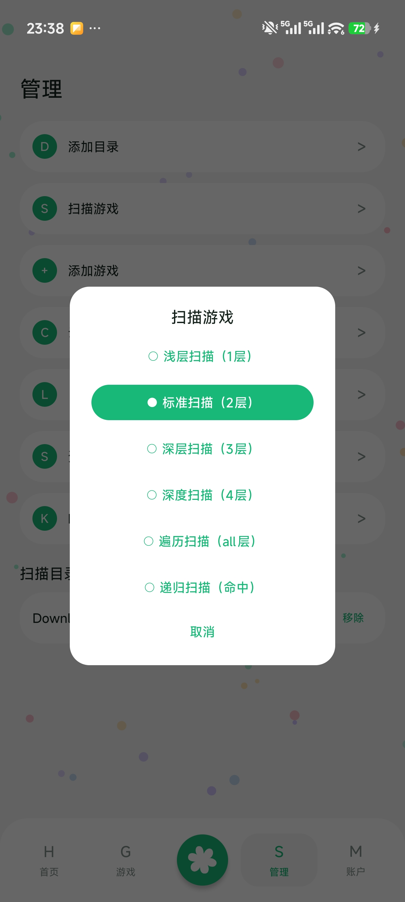</td>
      <td></td>
    </tr>
  </table>
</p>

<p align="center">
  <table>
    <tr>
      <td>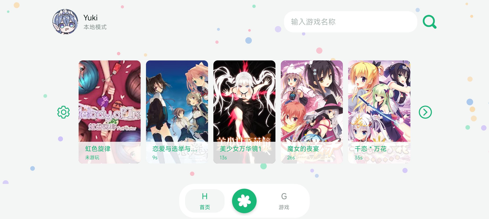</td>
    </tr>
    <tr>
      <td>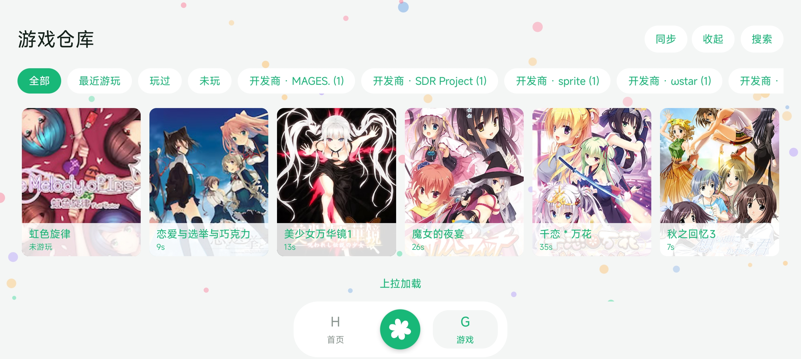</td>
    </tr>
    <tr>
      <td>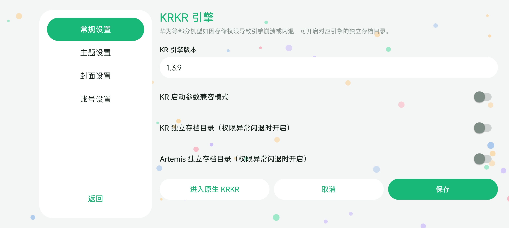</td>
    </tr>
  </table>
</p>

---

## Tutorial Area

### Import Winlator and G-station games and launch them directly

<p>
  <a href="https://b23.tv/Qixj22k">
    
  </a>
  <a href="https://github.com/xm486/YukiHub/releases/tag/v0.1.0">
  
</a>
</p>

* Notes:

  * The modified Winlator emulator package is based on the modified version by hostei2. `XServerDisplayActivity exported=false` was changed to `android:exported="true"` to expose the Activity for direct launch.
  * G-station games are based on the original version 5.3.5, with MT file extractor injection and Activity exposure. That is, add or change `android:exported="true"` for `android:name="com.xj.landscape.launcher.ui.gamedetail.GameDetailActivity"` in AndroidManifest.

### Tutorial for using WebDAV data cloud synchronization

<p>
  <a href="https://b23.tv/wuOvs5l">
    
  </a>
</p>

---

### Resolved Compatibility & Known Issues

- Text input dialogs in KRKR games are unavailable. Testing showed they cause crashes. Decompiling the hook revealed that the native library driver's `win32dialog.dll` is missing the `Header`, `allBitmaps`, and `finalize` functions required by the game.
- KRKR games on TF cards can now be launched via mirrored directory mode; save data location is consistent with independent save mode.
- Storage access compatibility on Huawei and similar devices has been improved: try enabling "External Private Save" or lightweight SAF. If issues persist, please report your device and reproduction steps.

PRs from capable developers are welcome. 😽

---

## Community Group

<p align="center">
  <a href="https://qun.qq.com/universal-share/share?ac=1&authKey=nZMa0s3mxxG1A0f%2BY0nAWmBYpul7FWTEDI6UWrzqb2IgKC4aDkUhvkV2AekAkW%2F1&busi_data=eyJncm91cENvZGUiOiIxNjM2MDM2MzUiLCJ0b2tlbiI6Im93eFRyY0tqNDdxK3FGQXlVZ0lhMEZGbWZWemphZnpYYW1kWWpPN1ViL3A0SkRUd1dEclMwZkM1bWI0UEYxME4iLCJ1aW4iOiIzMDg2Njc4NzU1In0%3D&data=bwoLG7XAPzqsvtfneNCQUUlu-HpX1yCn-6dkgd8ubDeBJKEPgd7wKYa6ym-EbW07Vapc3xm_o-iy0GbFHhZk5Q&svctype=4&tempid=h5_group_info">
    
  </a>
</p>

<p align="center">Welcome to join the QQ community group to report issues, make suggestions, or discuss features together.</p>

---

## Before Use

This project has a built-in disclaimer mechanism. On first launch, you need to check and agree to the disclaimer before continuing.

Please make sure you only use it to manage and launch games, apps, or resources that you have the right to use.

This project does not provide:

* Game files
* Cracked resources
* Ability to bypass authorization
* Support for any illegal use

---

## System Requirements

* Android 8.0 or above
* Requires partial file access permissions
* Some features may depend on system compatibility or third-party component support

---

## Permission Description

This app may request the following permissions:

* File read/write permission
* All files access permission
* Network permission

Purpose description:

* File permissions: used to read and manage game files, directories, and configurations
* Network permission: used for synchronization, online resources, or related features
* All files access: used for some directory-based game management scenarios

> Please grant permissions only when you clearly understand and accept their purposes.

---

## Installation

### Method 1: Install APK directly

Download the APK from the Releases page and install it.

### Method 2: Build it yourself

If you want to build the project yourself, please make sure you have installed:

* Android Studio
* Android SDK
* Gradle environment

Then open the project and run the build.

---

## Build Information

* Application ID: `com.yuki.yukihub.rinne`
* Source namespace: `com.core` (app) / `com.core.engine` (engine)
* Min SDK: `26`
* Target SDK: `33`
* Compile SDK: `36`
* Java: `17`
* Android Gradle Plugin: `8.13.2`
* Multi-module architecture: `app` + `engine` (standalone engine library module)
* Code shrinking: R8 + resource shrinking (Release)
* Current version: `0.9.9.9.5.3` (Version Code: `6`)

---

## Notes

* The project is currently in a continuous polishing stage before and after open-source release
* Some synchronization or cloud features depend on external service availability
* Some compatibility entries depend on the device environment and third-party app support

---

## Open Source License

This project is open-sourced under the **GNU General Public License v3.0 (GPL-3.0)**.

You may:

* Use it freely
* Modify it freely
* Distribute it freely
* Carry out secondary development under GPL-3.0 restrictions

Please use this project's source code under the terms of GPL-3.0.

---

## Disclaimer

This project is for legal use only.

The author is not responsible for the following situations:

* User operation mistakes
* Third-party resource issues
* System compatibility issues
* Third-party service unavailability
* Any illegal behavior caused by the user's use of this software

Please make sure you only use it to manage and launch software, games, or resources that you have the right to use.

---

## Acknowledgements

Thanks to the projects used as references and learning materials:

* krkr2
* YukiHub
* Tyranor
* Beacon
* <a href="https://github.com/Saramanda9988/LunaBox">LunaBox</a>
* Playnite
* <a href="https://github.com/YuriSizuku/OnscripterYuri">OnscripterYuri</a>
* <a href="https://github.com/hrydgard/ppsspp">ppsspp</a>

Thanks also to all users who participated in testing, feedback, and suggestions.

---

## Feedback and Contribution

If you encounter problems during use, feel free to submit an Issue or Pull Request.

You can also include the following when submitting feedback:

* Device model
* Android version
* Problem screenshots
* Reproduction steps
* Log information

This makes it easier to locate the issue.

---

## License

[GPL-3.0](./LICENSE)
